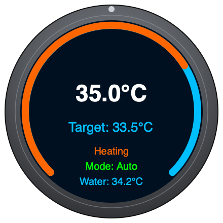

# Hot Tub Knob

ESPHome firmware for a [Waveshare ESP32-S3-Knob-Touch-LCD-1.8](https://www.waveshare.com/wiki/ESP32-S3-Knob-Touch-LCD-1.8)
(1.8" round knob display, capacitive touch, CNC metal case) that shows and
controls a hot tub heat pump exposed in Home Assistant as a `climate` entity.



*Mockup of the main screen layout (not a photo of the physical device) —
gauge arc for water temp, target setpoint, mode, and the heat pump's own
inlet/outlet temperature readings.*

## What it does

- Displays the dedicated water temperature sensor as the big center reading
  and gauge arc, with the heat pump's own water inlet/outlet temps shown as
  secondary readings below.
- Shows the target setpoint, adjustable by turning the physical knob in
  **0.5°C steps**.
- Shows what the heat pump is set to do as an icon: sun in red (Heating),
  snowflake in blue (Cooling), or a neutral gray thermostat-auto icon
  (Auto) - blank when off. A separate power symbol (top-right, LVGL's
  built-in power glyph) is green when on, gray when off.
- Shows the knob's own battery level (top-right, next to the power symbol)
  as a small battery icon whose fill bar grows/shrinks and changes color
  (green/orange/red) with charge, rather than a bare percentage.
- Turning the knob calls `climate.set_temperature` (debounced 400ms so rapid
  turning doesn't spam Home Assistant).
- Tapping the power symbol (top-right) toggles the heat pump between `auto`
  and `off` (`climate.set_hvac_mode`). Tapping anywhere else on the screen
  cycles Auto → Heating → Cooling (only while on) by writing directly to
  the heat pump's operating-mode Modbus register.
- The knob's position is synced from Home Assistant once at boot, then left
  alone so local turns aren't fought/overwritten by HA state updates.
- Backlight dims/sleeps after an idle timeout and wakes on touch or knob turn.

## Hardware

This board is unusual in two ways that caused most of the setup friction:

1. **No BOOT button.** There's a single small switch and a recessed reset
   pinhole, but no exposed BOOT/GPIO0 button. It doesn't matter, though —
   flashing works fine via plain `esptool`/`esphome` over USB without any
   button gymnastics.
2. **Dual MCU, single bidirectional USB-C port.** The board has two chips:
   - **ESP32-S3** (QFN56, 8MB PSRAM) — drives the display, touch, and knob.
     This is the one this firmware targets.
   - **ESP32-U4WDH** (classic ESP32, embedded flash) — a secondary chip,
     likely used for audio/mic/vibration-motor duties in Waveshare's stock
     voice-assistant demos. Not used by this project.

   **Which chip your computer talks to depends on which way the USB-C plug is
   inserted.** If `esptool`/`esphome` can't find an ESP32-S3, unplug the
   cable, flip it 180°, and try again. On macOS the two chips enumerate as
   different serial devices (e.g. `/dev/cu.usbmodem*` for the S3's native
   USB-Serial/JTAG, `/dev/cu.usbserial-*` for the U4WDH via its UART bridge).

- Display: ST77916 (round, 360x360, driven via `mipi_spi` in ESPHome core)
- Touch: CST816
- Rotary encoder: plain quadrature on GPIO7/GPIO8, read by the custom
  `rotary_encoder_custom` component (int-only, no fractional steps — see
  below for how we get 0.5°C per detent anyway)

## Repo layout

- `hot-tub-knob.yaml` — the whole ESPHome config (kept as a single file for
  now; small enough not to need splitting into packages)
- `secrets.yaml` — Wi-Fi credentials, API encryption key, OTA password
  (**gitignored** — never commit this)
- `secrets.yaml.example` — placeholder template for the above, safe to
  commit; copy it to `secrets.yaml` and fill in real values
- `.ha_token.secret` — a Home Assistant long-lived access token, used only
  for ad-hoc debugging via `curl` (**gitignored**)

## Configuration

Copy the secrets template and fill in real values:

```bash
cp secrets.yaml.example secrets.yaml
```

Edit the `substitutions:` block at the top of `hot-tub-knob.yaml`:

| Substitution | Meaning |
|---|---|
| `climate_entity` | Your heat pump's `climate.*` entity ID |
| `water_temp_entity` | A dedicated physical water-temp `sensor.*` entity (separate from the climate entity's own `current_temperature` attribute) |
| `screensaver` | How long the backlight stays on after the last touch/turn |
| `setpoint_min` / `setpoint_max` | Allowed setpoint range, in actual °C |
| `setpoint_min_units` / `setpoint_max_units` | Same range but ×2 (see "Half-degree steps" below) — keep these in sync manually if you change the range |

`secrets.yaml` needs:

```yaml
wifi_ssid: "..."
wifi_password: "..."
ap_password: "..."          # fallback hotspot password if Wi-Fi fails
api_encryption_key: "..."   # 32 random bytes, base64-encoded
ota_password: "..."
```

Generate a valid encryption key with:

```bash
python3 -c "import secrets,base64;print(base64.b64encode(secrets.token_bytes(32)).decode())"
```

## Building and flashing

Using `uv`/`uvx` (no need to install ESPHome globally):

```bash
# Validate config only
uvx --from esphome esphome config hot-tub-knob.yaml

# Compile only
uvx --from esphome esphome compile hot-tub-knob.yaml

# Compile + flash over USB
uvx --from esphome esphome run hot-tub-knob.yaml --device /dev/cu.usbmodem2101

# Compile + flash over the network (once it's on Wi-Fi)
uvx --from esphome esphome run hot-tub-knob.yaml --device hot-tub-knob.local

# Watch logs
uvx --from esphome esphome logs hot-tub-knob.yaml --device /dev/cu.usbmodem2101
```

**Important:** don't run `esphome logs` and `esphome run`/`upload` against the
same serial port at the same time — the log process holding the port open
while a flash is in progress can corrupt the write and brick-loop the board
(recoverable: just reflash cleanly with nothing else touching the port).

If the port isn't found or reports "No serial data received", flip the
USB-C cable 180° (see Hardware section above) rather than looking for a BOOT
button.

## Home Assistant setup — the one non-obvious step

**You must explicitly allow this device to control Home Assistant, or every
knob turn and tap will silently do nothing.**

By default, Home Assistant's ESPHome integration blocks devices from calling
services (`climate.set_temperature`, `climate.set_hvac_mode`, etc.). The
device connects fine, sensors flow in from HA fine, but every outgoing
service call gets silently rejected — with **no error visible from the
device side**. The only trace is in Home Assistant's own log:

```
Service call climate.set_temperature: with data {...} rejected;
If you trust this device and want to allow access for it to make Home
Assistant service calls, you can enable this functionality in the options flow
```

To fix it:

1. In Home Assistant: **Settings → Devices & Services → Integrations**.
2. Find the **ESPHome** entries — there's one card per physical ESPHome
   device (not just one for "ESPHome" overall). Locate the one for this
   board (e.g. "Hot Tub Knob").
3. Click the **⋮ menu → Configure** on that specific card.
4. Check **"Allow the device to perform Home Assistant actions"**.
5. Click **Submit**.

If you have multiple ESPHome devices, make sure you're configuring the right
one — it's easy to toggle a different device's entry by mistake.

## Design notes / tradeoffs

- **Half-degree knob steps.** The `rotary_encoder_custom` component only
  counts whole integers (no built-in step/scale option). To get 0.5°C per
  detent, the encoder's `min_value`/`max_value` are set to the real range
  ×2 (e.g. 26–40°C becomes 52–80), and every place that reads or writes the
  encoder's raw value divides or multiplies by 2 to convert to/from actual
  °C. Look for `pending_setpoint_units` / `ha_target_units` in the config —
  "units" always means half-degree steps, never actual °C.
- **Boot sync, plus a quiet-period periodic resync.** The knob's position
  is set from HA's current target temperature once, right after boot
  (`setpoint_synced` latches `true` after the first sync), so the display
  doesn't fight your hand mid-turn on startup. After that, an `interval:`
  every 10s re-applies the latest known HA target (`ha_target_units`,
  always kept current by `ha_target_temp`'s `on_value`) - but only when
  `knob_quiet` is true, i.e. the knob hasn't been physically turned in the
  last 10s (`mark_knob_active`). This is how a change made via HA or the
  app eventually shows up on the knob too, without visibly jumping the
  display while you're actively turning it.
- **`syncing_in_progress` guards against a sync looking like a turn.**
  `sensor.rotary_encoder_custom.set_value` internally calls `publish_state`
  (see the component's `loop()`), which fires `rotary_counter`'s own
  `on_value` - the same trigger a physical turn uses. Without a guard, every
  programmatic sync would also wake the backlight, reset `knob_quiet`, and
  echo an unnecessary `climate.set_temperature` back to HA.
  `sync_knob_from_ha` sets `syncing_in_progress` around the `set_value`
  call specifically so `rotary_counter`'s `on_value` handler can tell the
  two cases apart and skip all of that for a sync.
- **Debounced setpoint commits.** `commit_setpoint` uses `mode: restart`
  with a 400ms delay, so a burst of knob turns collapses into a single
  `climate.set_temperature` call after you stop turning, rather than one
  call per detent.
- **Gauge ring scale and target marker.** `temp_arc`'s range matches
  `setpoint_min`/`setpoint_max` (not some wider arbitrary scale), so the
  fill actually moves visibly instead of crawling across a much wider
  range. The unfilled track is a thin, dark "hollow" guide line
  (`arc_width: 3`, dark gray) rather than a solid color band; only the
  filled indicator (current value) is bold and colored. `target_marker` is
  a small dot placed on the ring by `update_target_marker`, which converts
  the target setpoint to an angle using the *same* start/end
  angle and min/max as `temp_arc` so it lines up with where the arc's own
  fill would reach at that value - see the trig in that script if the ring
  geometry (radius, angles) ever changes, since the marker's math is
  derived from those same constants rather than referencing them directly.
- **`current_temp` vs `water_temp`.** The big number on the main gauge is
  driven by `water_temp_entity`'s standalone sensor; the heat pump's own
  water inlet/outlet temps (`current_temp` / `water_outlet_temp`) are shown
  as smaller secondary readings at the bottom. These may or may not be the
  same physical measurement as `water_temp_entity`, so both are shown
  rather than assuming they're identical.
- **No `hvac_action` on this climate entity - `lbl_mode` uses a Modbus
  register instead.** `climate.hot_tub_heat_pump` is HA's built-in
  `modbus:` climate platform, which has no concept of `hvac_action` at all -
  confirmed via the HA REST API (`/api/states/climate.hot_tub_heat_pump`
  never has that attribute). `update_mode_label` instead reads
  `heat_pump_operating_mode_entity`, a raw Modbus enum register
  (`sensor.hot_tub_heat_pump_operating_mode` in ha-stack's
  `modbus_hottub.yaml`, not part of this repo) where `0=Auto, 1=Heating,
  2=Cooling`, confirmed by switching modes in the vendor app and reading the
  register back each time. This is a *selected-mode* register, not a live
  running/idle signal - it stays put even while the compressor is idle
  within that mode. Full register-map background lives in the `ha-stack`
  repo's `pool-heatpump-integration.md`. (An earlier version of this
  firmware also derived a live Heating/Cooling/Idle/Off status from the
  inlet/outlet temp delta - removed as redundant once this register was
  wired up.)
- **Two touch zones on one touchscreen.** With no second button available,
  `on_touch`'s trigger variable `touch.x`/`touch.y` is used to split the
  screen into two zones: the top-right corner (near the `pwr_dot` widget,
  roughly `x > 260 && y < 100`) toggles on/off; everywhere else cycles the
  operating mode. There's no HA-native entity to write the operating-mode
  register (it's a raw Modbus enum, see above), so `cycle_operating_mode`
  calls the generic `modbus.write_register` service directly - the same
  approach used for `climate.set_temperature`, just one level lower since
  no purpose-built HA entity exists for this register.

## Troubleshooting

- **Nothing happens on knob turn or tap, no errors anywhere** → almost
  always the "Allow Home Assistant actions" permission above. Confirm by
  checking Home Assistant's log (Settings → System → Logs, or
  `/api/error_log` via the REST API) right after interacting with the
  device — a silent rejection shows up there, not in the ESPHome logs.
- **`esptool`/`esphome` can't find the ESP32-S3** → flip the USB-C cable.
- **Board boot-loops after a flash** ("no bootable app partitions") → almost
  always caused by something else holding the serial port during the write
  (e.g. a leftover `esphome logs` process). Kill any process using the port
  (`lsof /dev/cu.usbmodem*`) and reflash.
- **Want to see exactly what value/action is being sent** → temporarily add
  a `logger.log:` step before the `homeassistant.action:` in the relevant
  script, reflash, and watch `esphome logs`. This is how the permission
  issue above was actually diagnosed — the ESP side logs confirmed correct
  values were being sent well before we found the HA-side rejection.

## License

[MIT-0](LICENSE) — do whatever you want with this, no attribution required.
